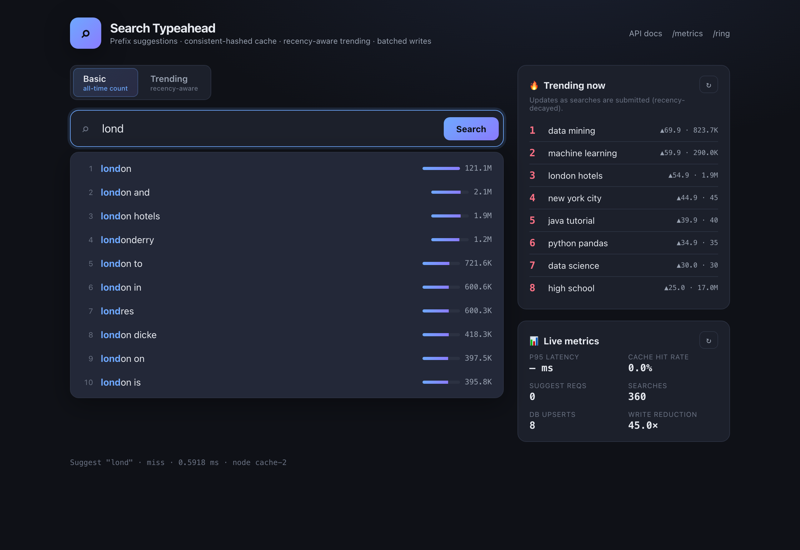
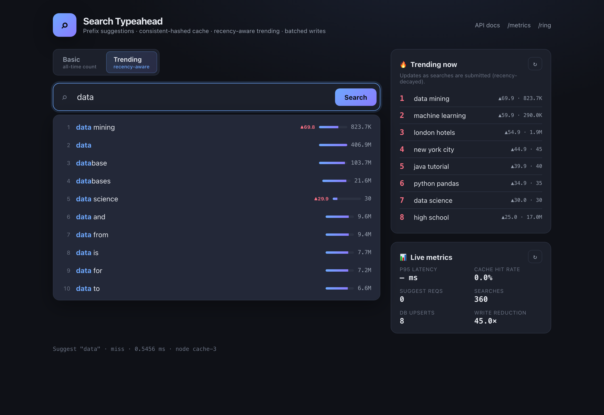
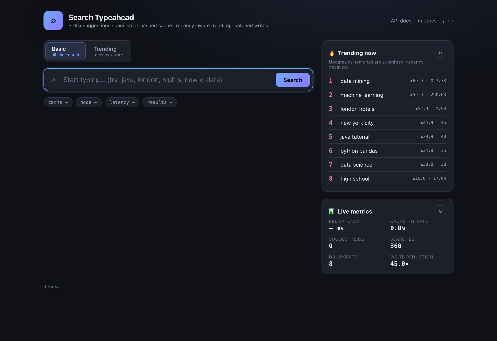
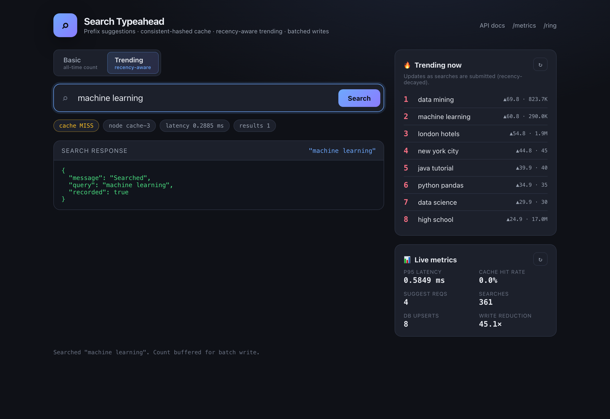

# Search Typeahead System

A low-latency search-suggestion service — the autocomplete you see in search
engines and e-commerce sites — built to demonstrate the **backend data-system
design** behind it: how query-count data is stored, how suggestions are served
in microseconds, how the cache is distributed with **consistent hashing**, how
ranking blends **all-time popularity with recency**, and how writes are
**batched** to take pressure off the primary store.

> Type a prefix → get the top 10 matching queries ranked by popularity (or by
> trending activity). Submit a search → it's recorded, aggregated, and batched to
> the database, and it bubbles up in suggestions and trending.

| Rubric component | Where it lives | Status |
|---|---|---|
| Dataset ingestion (≥100k, with counts) | `scripts/load_dataset.py` (300k real queries) | ✅ |
| Search UI (debounce, keyboard nav, states) | `app/static/` | ✅ |
| `/suggest` API (≤10, prefix, count-sorted) | `app/trie.py`, `app/service.py` | ✅ |
| `/search` API (dummy response + record) | `app/service.py`, `app/batch_writer.py` | ✅ |
| Query-count updates | `app/storage.py` + batch writer | ✅ |
| Distributed cache + **consistent hashing** | `app/cache.py`, `app/consistent_hash.py` | ✅ |
| **Trending** (recency-aware ranking) | `app/ranking.py` | ✅ (+20) |
| **Batch writes** (buffer, aggregate, flush, WAL) | `app/batch_writer.py` | ✅ (+20) |
| Performance report (p95, hit rate, write reduction) | `PERFORMANCE.md`, `scripts/benchmark.py` | ✅ |
| Design rationale (viva) | `DESIGN.md` | ✅ |

---

## Demo

**Basic vs. Trending ranking** — the same prefix, two ranking modes. In basic
mode `data` is ranked purely by all-time count; in trending mode a recently
surging query (`data mining`) is promoted to the top even though its all-time
count is far lower:

| Basic (all-time count) | Trending (recency-aware) |
|---|---|
|  |  |

**Overview & search submission** — debounced suggestions, a live trending panel,
live metrics (cache hit rate, p95 latency, write-reduction), and the dummy
`/search` response with per-request cache-node + latency badges:

| Overview | Search response |
|---|---|
|  |  |

Regenerate these any time with `python -m scripts.screenshot` (server running).

---

## Quickstart

```bash
# one command: venv + deps + dataset + server
./run.sh

# offline (no dataset download — uses the synthetic Zipfian generator)
./run.sh --synthetic
```

Then open **http://127.0.0.1:8077** for the UI, or **/docs** for interactive API
docs.

<details>
<summary>Manual setup (equivalent to <code>run.sh</code>)</summary>

```bash
python3 -m venv .venv && source .venv/bin/activate
pip install -r requirements.txt

# get the real dataset (optional — synthetic works offline)
bash scripts/fetch_dataset.sh

# load it into the primary store (SQLite)
python -m scripts.load_dataset --limit 300000          # real data
# or: python -m scripts.load_dataset --source synthetic --limit 300000

# run
uvicorn app.main:app --host 127.0.0.1 --port 8077
```
</details>

Requires Python 3.11+ (developed on 3.14). No external services — the cache and
index are in-process; the primary store is a local SQLite file.

---

## Architecture

```
                          Browser UI (app/static)
                 debounced /suggest · /search · /trending
                                   │  HTTP
        ┌──────────────────────────┴───────────────────────────┐
        │                  FastAPI  (app/main.py)                │
        │                                                        │
        │   GET /suggest                    POST /search         │
        │        │                                │              │
        │        ▼                                ▼              │
        │  ┌────────────┐                  ┌──────────────┐      │
        │  │ Distributed │  miss   ┌─────► │ Batch Writer  │      │
        │  │   Cache     ├────────►│ Trie  │  buffer+agg   │      │
        │  │ (N nodes)   │◄──set── │ top-K │  + WAL        │      │
        │  └─────┬───────┘         └───┬───┘  └──────┬─────┘      │
        │        │ consistent-hash      │ rank        │ flush     │
        │        │   ring routes        ▼ (basic/     │ (periodic │
        │        │   prefix→node   ┌──────────┐  trending)│  or by  │
        │        │                 │ Recency  │           │  size)  │
        │        │                 │ Tracker  │           ▼         │
        │        │                 │ (decay)  │     ┌───────────┐   │
        │        │                 └──────────┘     │  SQLite   │   │
        │        │                                  │ (counts)  │   │
        │        │   ◄──── invalidate prefixes ─────┤  source   │   │
        │        │         on flush                 │  of truth │   │
        │        └──────────────────────────────────┴───────────┘  │
        └────────────────────────────────────────────────────────┘
```

**Read path** (`/suggest`): normalize prefix → consistent-hash to a cache node →
HIT returns immediately; MISS walks the trie to the prefix node, ranks its
candidates (all-time count, or blended with recency), caches the result, returns.

**Write path** (`/search`): normalize query → append to WAL → bump an in-memory
buffer (repeated queries aggregate) → update recency instantly → return
`{"message": "Searched"}`. A background task flushes the buffer to SQLite
periodically or when it's full, refreshes the trie, and invalidates the affected
cache prefixes.

See **[DESIGN.md](DESIGN.md)** for the full rationale behind every choice.

---

## API

### `GET /suggest?q=<prefix>&mode=<basic|trending>&limit=<n>`
Top suggestions for a prefix.

```bash
curl 'http://127.0.0.1:8077/suggest?q=java&mode=basic'
```
```json
{
  "prefix": "java", "mode": "basic", "count": 10,
  "suggestions": [
    {"query": "java", "count": 55360149, "score": 55360149.0},
    {"query": "javascript", "count": 25766226, "score": 25766226.0}
  ],
  "cache": "miss", "node": "cache-1", "latency_ms": 0.086
}
```
- Returns at most `limit` (default 10) suggestions, all starting with the prefix,
  sorted by count (basic) or blended recency score (trending).
- Empty/whitespace prefix → `{"suggestions": [], "cache": "bypass"}` (handled
  gracefully, no work done). Mixed case and surrounding spaces are normalized.

### `POST /search`
Submit a search. Returns the dummy response and records the query.

```bash
curl -X POST http://127.0.0.1:8077/search \
     -H 'Content-Type: application/json' -d '{"query":"java tutorial"}'
```
```json
{"message": "Searched", "query": "java tutorial", "recorded": true}
```
- Existing query → count incremented; new query → inserted. The update is
  buffered and applied on the next batch flush, then reflected in suggestions and
  trending.

### `GET /cache/debug?prefix=<prefix>&mode=<basic|trending>`
Shows which cache node owns a prefix and whether it's currently cached.

```bash
curl 'http://127.0.0.1:8077/cache/debug?prefix=java'
```
```json
{
  "prefix": "java", "cache_key": "suggest:basic:java", "key_hash": 2514721547,
  "responsible_node": "cache-1", "virtual_node": "cache-1#88",
  "result": "hit", "ttl_remaining_s": 29.8, "node_size": 1,
  "ring": {"nodes": ["cache-0","cache-1","cache-2","cache-3"], "total_points": 600, "vnodes_per_node": 150}
}
```

### `GET /trending?n=<n>`
Top trending queries by recency-decayed score.
```bash
curl 'http://127.0.0.1:8077/trending?n=5'
```

### `GET /metrics`
Latency percentiles, cache hit rate, DB read/write counts, batch write-reduction,
index size. Used by the live metrics panel in the UI and the benchmark.

### `GET /ring?sample=<n>`
Routes `n` synthetic keys through the ring and reports per-node load — evidence
that consistent hashing distributes keys evenly.

### `GET /health`
Liveness + indexed query count.

---

## Dataset

Default: **Peter Norvig's word-frequency lists** (https://norvig.com/ngrams/) —
`count_1w.txt` (333,333 single keywords) + `count_2w.txt` (286,358 two-word
phrases), each with a real corpus count. We ingest the **top 300,000** by count,
giving ~90k single-word keywords and ~210k realistic multi-word queries
(`high school`, `new york`, `data mining`, …). This satisfies the "≥100k queries
with counts" requirement with genuine data.

Input format is `query<TAB>count`; the loader normalizes (lowercase, collapse
whitespace), filters corpus noise, merges duplicates keeping the max count, and
takes the top-N.

**Offline fallback:** `--source synthetic` deterministically generates 300k
queries with a Zipfian count distribution (the same head-and-long-tail shape real
search traffic has), so the project runs with zero network access.

```bash
python -m scripts.load_dataset --source auto       --limit 300000   # default
python -m scripts.load_dataset --source wordfreq   --limit 333333   # all unigrams+bigrams
python -m scripts.load_dataset --source synthetic  --limit 150000 --seed 7
```

---

## Project structure

```
app/
  main.py            FastAPI app, endpoints, startup/shutdown lifecycle
  service.py         orchestration: read path, write path, trending, metrics
  trie.py            prefix index with per-node materialised top-K
  consistent_hash.py hash ring with virtual nodes
  cache.py           CacheNode (TTL+LRU) + DistributedCache (ring-routed)
  ranking.py         recency tracker (exponential decay) + score blending
  batch_writer.py    buffer + aggregation + periodic/size flush + WAL recovery
  storage.py         SQLite primary store (batched upserts)
  metrics.py         latency percentiles + request counters
  config.py          env-overridable settings
  static/            the web UI (index.html, style.css, app.js)
scripts/
  load_dataset.py    dataset ingestion (real + synthetic)
  fetch_dataset.sh   download the real dataset
  benchmark.py       latency / hit-rate / write-reduction benchmark
tests/               unit + integration tests (pytest or unittest)
DESIGN.md            deep design rationale (viva prep)
PERFORMANCE.md       measured results + methodology
```

---

## Configuration

Everything is tunable via environment variables (defaults in `app/config.py`):

| Variable | Default | Meaning |
|---|---|---|
| `TYPEAHEAD_DB` | data/typeahead.db | SQLite primary-store path |
| `TYPEAHEAD_SUGGEST_LIMIT` | 10 | default number of suggestions returned |
| `TYPEAHEAD_TRIE_K` | 25 | candidate pool kept per trie node |
| `TYPEAHEAD_CACHE_NODES` | 4 | number of logical cache nodes |
| `TYPEAHEAD_CACHE_VNODES` | 150 | virtual nodes per node on the ring |
| `TYPEAHEAD_CACHE_TTL` | 30 | cache entry TTL (seconds) |
| `TYPEAHEAD_CACHE_CAP` | 5000 | max entries per cache node before LRU eviction |
| `TYPEAHEAD_BATCH_SIZE` | 500 | flush when buffer reaches this many distinct queries |
| `TYPEAHEAD_FLUSH_INTERVAL` | 2.0 | flush at least this often (seconds) |
| `TYPEAHEAD_NEW_QUERY_COUNT` | 1 | count added per search / initial count for a new query |
| `TYPEAHEAD_WAL` | 1 | enable the write-ahead log (set 0 to disable) |
| `TYPEAHEAD_WAL_PATH` | data/buffer.wal | write-ahead log path |
| `TYPEAHEAD_RANK_MODE` | basic | default ranking mode for `/suggest` |
| `TYPEAHEAD_HALF_LIFE` | 1800 | recency score half-life (seconds) |
| `TYPEAHEAD_RECENCY_WEIGHT` / `_HISTORY_WEIGHT` | 0.6 / 0.4 | trending blend weights |
| `TYPEAHEAD_TRENDING_CAP` | 50000 | max queries the recency tracker retains |
| `TYPEAHEAD_LATENCY_WINDOW` | 20000 | recent latency samples kept for percentiles |

---

## Testing

```bash
python -m pytest tests/ -q          # 46 tests
# or, with zero extra deps:
python -m unittest discover -s tests
```

Covers: trie top-K correctness vs brute force (bulk + incremental), consistent-
hash distribution + minimal-remap property, cache TTL/LRU/routing, recency decay
and anti-over-ranking, the recency blend, batch aggregation + write reduction,
**WAL crash recovery** (incl. commit-then-crash and consecutive-failure cases),
and the end-to-end service flows.

### Reproduce the evidence

```bash
python -m scripts.demo        # in-process logs: consistent hashing, basic vs
                              # trending, and batch write-reduction (no server)
```

This prints labelled logs demonstrating all three graded behaviours — handy for
the viva and as submission evidence. (`scripts/benchmark.py` does the same for
latency/hit-rate/write-reduction against the live server.)

A consolidated **PDF report** (architecture, dataset, API, design choices &
trade-offs, performance) is at [`Project_Report.pdf`](Project_Report.pdf);
rebuild it with `python -m scripts.build_report`.

---

## Performance (summary)

| Metric | Result |
|---|---|
| `/suggest` server-side latency p95 | **~10 µs** |
| `/suggest` end-to-end p95 (unloaded) | **0.84 ms** |
| Cache hit rate (Zipfian workload) | **96.1 %** |
| Batch write reduction | **7.75×** (87.1 % of writes avoided) |
| Index: 300k queries / 934k nodes | ~1.3 s build, ~351 MB RSS |

Full methodology and the latency-vs-concurrency curve are in
**[PERFORMANCE.md](PERFORMANCE.md)**.
